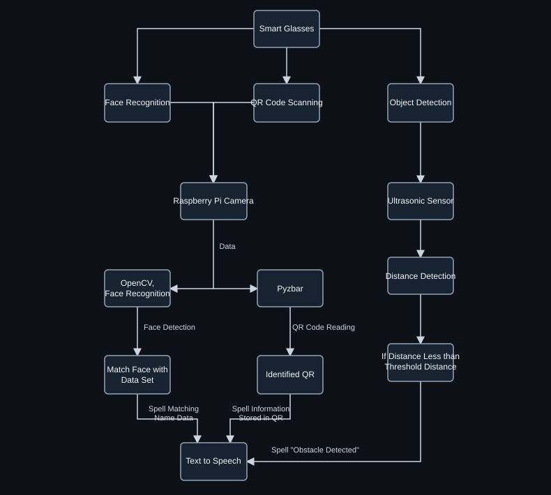
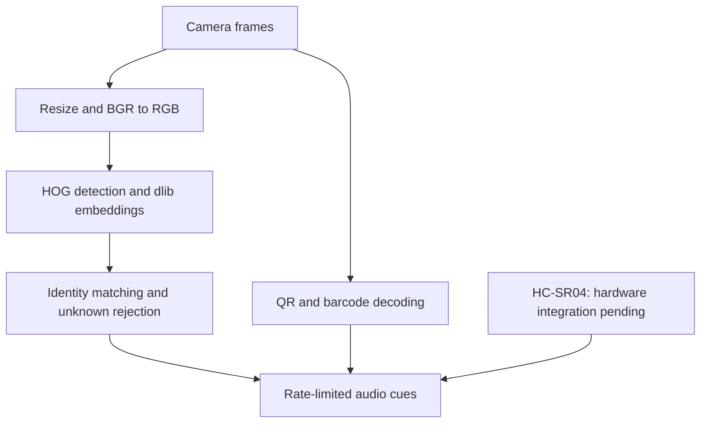

# Assistive Vision Smart Glasses

[](https://github.com/PrashantSinghpns/assistive-vision-smart-glasses/actions/workflows/ci.yml)

**Computer vision for accessible interaction: face identification, QR decoding, proximity awareness, and spoken feedback on Raspberry Pi.**

Academic project by **Prashant Singh, Rishabh Raj, and Vardaan Sharma**, supervised by **Dr. Arun Kumar G.**, JSS Academy of Technical Education, Noida (June 2025).

> Repository status: reconstructed reference implementation derived from the supplied project report. Original Python files, enrolled images, model artifacts, and benchmark logs have not been supplied. This version is not yet validated on the original hardware.

## Overview

The prototype translates visual and proximity information into audio cues for people with visual impairments. Its machine learning component uses pretrained dlib facial embeddings to identify enrolled individuals. QR decoding and ultrasonic ranging complement the vision pipeline.

## Technical capabilities

| Component | Implementation evidenced in the report | Repository status |
|---|---|---|
| Face detection | HOG detector through `face_recognition` | Reconstructed |
| Identity representation | Pretrained dlib facial embeddings | Reconstructed |
| Face identification | Embedding comparison and identity matching | Reconstructed with nearest-distance rejection |
| Enrollment | Images grouped by identity; extracted embeddings | Reconstructed; private dataset required |
| QR/barcode decoding | Pyzbar/ZBar | Reconstructed |
| Audio output | eSpeak; one report variant uses gTTS | Offline eSpeak adapter reconstructed |
| Proximity sensing | HC-SR04 and RPi.GPIO | Hardware integration documented; original module required |
| Semantic object detection | Discussed in slides, no detector implementation or weights provided | Future work |

**Skills demonstrated:** Python, OpenCV, image preprocessing, HOG face localization, pretrained feature extraction, embedding-based classification, open-set rejection, dataset organization, inference pipelines, Linux deployment, and multimodal assistive interfaces.

This is pretrained representation learning plus identity enrollment, not training a neural network from scratch. LBPH appears in the literature review; the report's executable examples use dlib embeddings.

## Architecture

### Project block diagram



*Dark vector rendering of the team-supplied project block diagram. The "Object Detection" branch represents ultrasonic obstacle/proximity detection; it does not depict a semantic object classification model. Sensor integration remains pending in the reconstructed code. [Original diagram](docs/assets/system-block-diagram.png).*

### Reference implementation flow



The reconstructed application uses one camera stream and shares frames between face recognition and decoding. Audio events are queued to a bounded worker; inference does not wait for speech playback.

## Repository contents

- `src/assistive_vision/enroll.py`: enrollment image validation and embedding export.
- `src/assistive_vision/app.py`: live camera inference and optional offline speech.
- `src/assistive_vision/matching.py`: identity selection and distance threshold rejection.
- `src/assistive_vision/gallery.py`: gallery schema and biometric vector validation.
- `tests/`: matching, gallery validation, CLI, and simulated camera lifecycle checks.
- `docs/`: architecture, evaluation protocol, hardware integration, and source traceability.
- `.github/workflows/ci.yml`: syntax and dependency-free unit checks.

## Local setup

Use Python 3.11 for the camera implementation. Core checks cover Python 3.11–3.13; native vision dependency installation and camera behavior still require validation on your machine.

```bash
python -m venv .venv
# Linux / Raspberry Pi
source .venv/bin/activate
# Windows PowerShell
# .venv/Scripts/Activate.ps1
python -m pip install -e ".[vision]"
```

The vision dependencies require native dlib support and a ZBar installation. On Raspberry Pi/Linux, install the distribution packages for ZBar and eSpeak, plus dlib build prerequisites if a compatible wheel is unavailable. USB cameras exposed through OpenCV are the initial capture target; CSI camera support requires a suitable capture adapter.

For a lightweight code review and tests without installing native vision libraries:

```bash
python -m pip install -e .
python -m unittest discover -s tests -v
assistive-vision --help
```

See [troubleshooting](docs/TROUBLESHOOTING.md) for dependency, camera, audio, and gallery errors.

## Enrollment and inference

Create a local, consent-based image collection:

```text
data/enrollment/
  person_a/
    image_01.jpg
    image_02.jpg
  person_b/
    image_01.jpg
```

Use separate capture sessions for evaluation. Enrollment accepts images containing exactly one detected face and records rejected inputs.

```bash
python -m assistive_vision.enroll --dataset data/enrollment --output models/identities.json
python -m assistive_vision.app --gallery models/identities.json --camera 0
# Enable offline audio when eSpeak is installed:
python -m assistive_vision.app --gallery models/identities.json --camera 0 --speak
# Raspberry Pi over SSH; bounded camera smoke check:
assistive-vision --gallery models/identities.json --headless --max-frames 100
```

Press `q` to exit the preview or Ctrl+C in headless mode. `--threshold` is a maximum embedding distance, not a probability. The default 0.6 is a starting parameter requiring calibration; it is not a measured optimal threshold. `--cooldown` controls repeat announcements. Install distribution-level display libraries where needed even when using the headless option; the vision extra includes the standard OpenCV package.

## Results and reproducibility

The June 2025 report states face recognition under 1 second in ideal lighting, 1.5–2 seconds in difficult lighting, QR decoding in 0.5–1 second, and overall response below 2 seconds. These are **author-reported observations**, not reproduced benchmarks. Sample counts, raw predictions, timing logs, and statistical methodology were not supplied.

No verified accuracy percentage, FPS, power profile, or publication identifier is claimed by this repository. See [evaluation protocol](docs/EVALUATION.md) for the measurements needed to substantiate results.

## Constraints and roadmap

- Validate reconstructed code against original source and Raspberry Pi hardware.
- Add a timeout-protected ultrasonic adapter after resolving GPIO discrepancies.
- Calibrate unknown-face rejection on held-out known and unknown identities.
- Record latency, recognition errors, and QR success rates across lighting and distance.
- Add semantic object detection only with a selected model, weights, label map, and reproducible evaluation.

This is an academic assistive prototype; obstacle cues do not establish navigation reliability. Do not publish biometric datasets or treat decoded QR payloads as executable instructions.

## Attribution and licensing

Credit the complete project team above. Individual contribution boundaries are not established by the supplied documents. No software license has been assigned pending confirmation of team ownership and preferred terms. The private source PDFs are omitted from the public package because they contain personal information.
